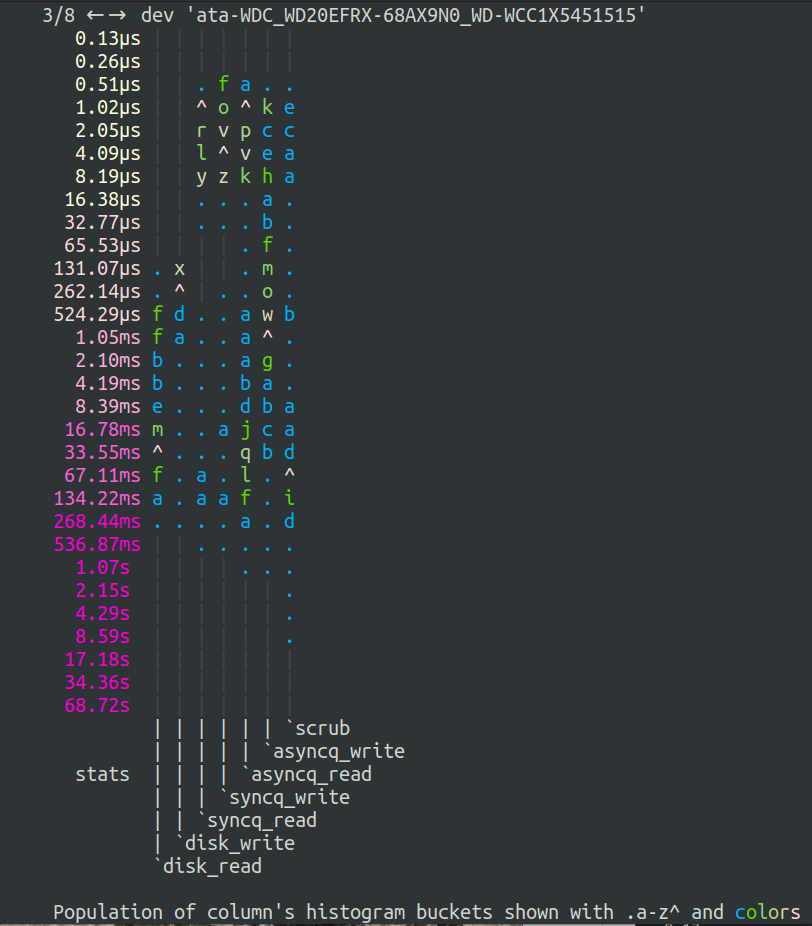

# Getting the gist of zfs statistics

https://user-images.githubusercontent.com/287758/131224903-c7ec43ce-66b1-4caa-bc69-c969468a76d2.mp4

The ZFS command "zpool iostat" provides a histogram listing of how often it takes to do things in parts of your pool. It's useful to find bottlenecks and problem devices, but it's also kind of hard to read, with the nearly 4000 mixed-unit numbers.

## What's a histogram?

A histogram is an arrangement of data to show how measurements can be different and how often. For instance, last year, 60 times it took Joe 3-to-4 hours to drive to Albequerque, and 20 times it took 4-to-5 hours, 80 times it took 5-to-6 hours, and 2 times it took 6-to-7 hours. That 60-times & 20-times & 80-times & 2-times is a histogram showing population of the buckets of driving-times. It can help you understand the pattern of likelihoods. It seems when Joe has a traffic problem, it's usually pretty big; and problems happen more often than not; but sometimes it's a breeze.

<table><tr><th>count</th><td>0</td><td>60</td><td>20</td><td>80</td><td>2</td><td>0 times</td></tr><tr><th>bucket</th><td>0 to 3</td><td>3 to 4</td><td>4 to 5</td><td>5 to 6</td><td>6 to 7</td><td>7 to 8 hours</td></tr></table>

## Mentally sizing the huge absolute numbers from ZFS

The *exact number* of items in a histogram bucket *does not matter at all*. 36778213 ZFS operations vs 39214291 isn't a good comparison for humans to try to make. For understanding what's happening in your ZFS pool, the gist and relative sizes is what's important, so the numerical output of the "zpool iostat" tool is harder to understand than it needs to be. That's the problem this tool aims to fix.

The tools here will summarize and display relative sizes of those numbers, side-by-side, to help you see what's important.

# You can help!

There are some opinionated coloring of time herein, and those opinions are not well-informed. If you have a suggestion on how to better slice up the six white-to-red colors of time, please file a ticket. Mention the your (at max) five thresholds to the next color plateau, in nanoseconds.

Also, if the tool crashes, please file a ticket with the output. Include the stack trace.

# Meanings of output

The histogram uses both colors to show relative population, but also glyphs. The glyphs are "." meaning the smallest but nonzero, "a" up through "z", and "^" represents the highest number among the buckets. The glyphs represent linear-growing, equidistant-apart number ranges.  "f" is 4 times farther away from "b" than "c" is from "b".

# Usage and prerequisites

To run, have Python 3.4 or greater, and run it with the pool name(s) as parameter.

`$ zpool-iostat-viz`

`$ zpool-iostat-viz tank1 tank2`

`$ zpool-iostat-viz tank vdev42 vdev90 vdev163`

`$ zpool-iostat-viz -d`

It displays data points in the histogram as letters of the alphabet, scaled and colored to show hot-ness of that bucket. It's scaled so that each column has a most-filled "^", and the rest of the letters show relative population vs the most populous bucket.

Also useful is the differential updates mode, which you can select with "-d" parameter. It's like stats are reset every three seconds, so you can see what's happening right now with your pool, not since boot.

Press arrows to move stats, and press `q` to quit.  "--help" argument to see what other options you have.
